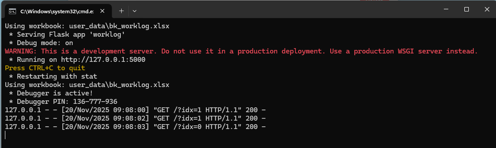
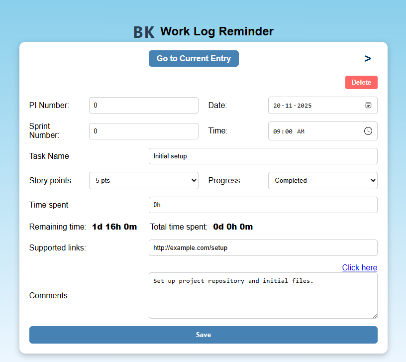
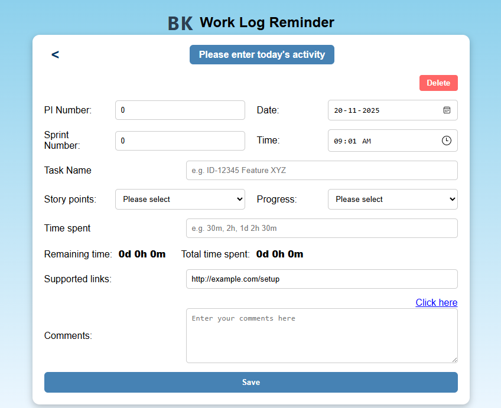

# Logme

About Logme.exe
=================
This exe will create a log book excel file in the same directory where exe is placed.

user can log the work details in the excel file using a simple web page (http://127.0.0.1:5000).
run the exe file and a web page will open in the default browser.

main page


update current Entry
=========================


** this still in development phase, basic features only available now.

current version creates a excel file with following columns
=========================
- Date
- Time	
- last updated	
- Weeknumber	
- PI_Sprint	
- Story points
- Task Name	
- Comments	
- Progress	
- Time spent	
- Remaining time	
- Total time spent	
- Supported links

Configurable parameters
=========================
- Excel file name
- Default PI number
- Default Sprint number
- Default Story points
- Default Task name
- Default Comments
- Default Progress
- Default Time spent
- Default Remaining time
- Default Supported links
- Reminder time interval in minutes
How to configure
=========================
- Open config.json file in a text editor
- Change the parameters as per your requirement
- Save the file
json file parameters description
=================================
- book_name : Name of the excel file
- last_pi : Default PI number
- last_sprint : Default Sprint number
- Work_book_Header : List of column names in the excel file
- work_book_sample_data : Default values for each column in the excel file
- launch_times : List of times when the reminder will pop up
- is_history_enabled : Enable/Disable history feature default is false
- launch_on_startup : Enable/Disable launch on startup feature default is true
- reminders : Reminder settings -- still in development phase
- web_page_url : URL of the web page -- still in development phase
- port : Port number for the web page -- still in development phase
- current web page url : http://127.0.0.1:5000
```json

{
    "reminder": "every 2hr",
    "book_name": "bk_worklog",
    "usr_folder": "user_data",
    "test_book_name": "worklog",
    "test_folder": "test",
    "sheet_names": [
        "PI",
        "Sprint",
        "PI&Sprint"
    ],
    "launch_times": [
        "09:00",
        "14:00",
        "17:20",
        "19:50"

    ],
    "reminders": {
        "is_enabled": true,
        "selected": "every 5min",
        "options": {
            "every 5min":5,
            "every 15min":15,
            "every 30min":30,
            "every 1hr":60,
            "every 2hr":120,
            "every 3hr":180,
            "every 4hr":240,
            "every 6hr":360,
            "every 8hr":480,
            "every 12hr":720,
            "every day":1440
        }
    },
    "is_history_enabled": "false",
    "launch_on_startup": true,
    "last_pi": "PI2",
    "last_sprint": "12",
    "last_mode": "PI",
    "Work_book_Header": [
        "Date",
        "Time",
        "Weeknumber",
        "PI_Sprint",
        "Story points",
        "Task Name",
        "Comments",
        "Progress",
        "Time spent",
        "Remaining time",
        "Total time spent",
        "Supported links"
    ],
    "work_book_sample_data": 
        {
            "Date": "2024-06-01",
            "Time": "09:00",
            "Weeknumber": "W46",
            "PI_Sprint": "PI0_Sprint0",
            "Story points": "5",
            "Task Name": "Initial setup",
            "Comments": "Set up project repository and initial files.",
            "Progress": "Completed",
            "Time spent": "0h",
            "Remaining time": "0h",
            "Total time spent": "0h",
            "Supported links": "http://example.com/setup"
        },
    "web_page_url":"http://localhost:",
    "port":8000
    
}
```
How to run
=========================
- Double click on logme.bat file
- A web page will open in your default browser
- Fill the form and click on submit button to log the work details
- The details will be saved in the excel file
- excel file will be created in the same directory where exe is placed
- You can open the excel file to view the logged work details
- To set reminder, open config.json file and set the reminder time interval in minutes
- Save the file and run the logme.bat file again
- A reminder will pop up after the specified time interval
- Click on the reminder to open the web page and log the work details